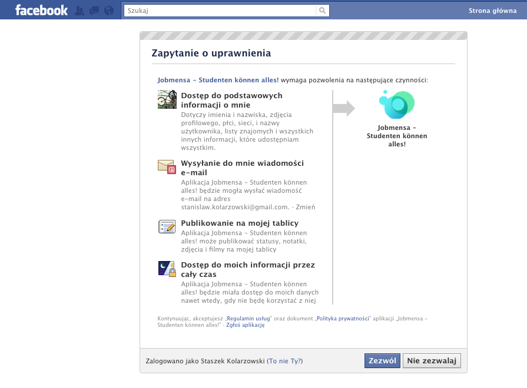

!SLIDE 
#Oauth#
!SLIDE
##Logowanie do facebooka##
!SLIDE

!SLIDE bullets incremental
#Wysyłamy#
  * client id
  * secret
  * scope -> email, offline_access, publish_stream
!SLIDE bullets incremental
#Odbieramy#
  * token
  * podstawowe dane(imię, nazwisko itp.)
  * adres email
  * komunikat błędu
!SLIDE
#offline access#
##token jest aktualny cały czas##
!SLIDE
#offline access#
##token jest aktualny **prawie** cały czas##
!SLIDE bullets
  * zmiana adresu email
  * użytkownik skasował naszą aplikację
