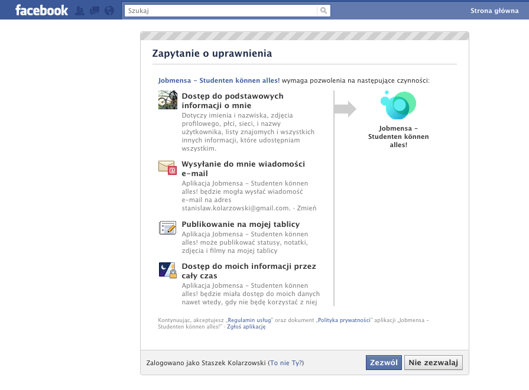

!SLIDE
#Omniauth#
##https://github.com/intridea/omniauth##
!SLIDE smaller

	@@@ ruby
	require 'oa-oauth'
	
	use OmniAuth::Strategies::Facebook, 
	'CONSUMER_KEY', 'CONSUMER_SECRET'
	
!SLIDE smaller

	@@@ ruby
	require 'oa-oauth'
	
	use OmniAuth::Strategies::Facebook, 
	'CONSUMER_KEY', 'CONSUMER_SECRET', 
	:scope => "email, offline_access, publish_stream"

!SLIDE
##/auth/facebook##
!SLIDE

!SLIDE
##/auth/facebook/callback##

	@@@ ruby
	auth = request.env['omniauth.auth']
		
!SLIDE
	@@@ ruby
	{
		'uid' => '12356',
		'provider' => 'twitter',
		'user_info' => {
			'name' => 'User Name',
			'nickname' => 'username',
			# ...
		},
		'credentials' => {
		 'token' => '1221fsfdasfsf', 
			# ...
		}
	}
!SLIDE
##/auth/facebook/failure?message=xyz##
!SLIDE smaller

	@@@ ruby
	map.auth_callback '/auth/:provider/callback', 
	:controller => 'identifications', :action => 'create'

	
