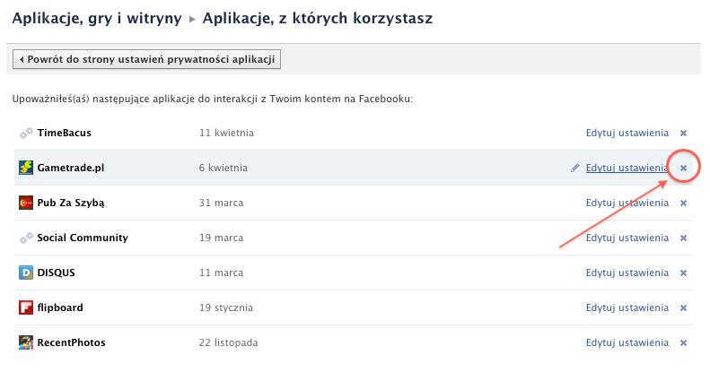
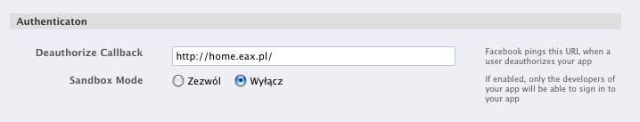

!SLIDE
# Deautoryzacja #
!SLIDE center

!SLIDE
# Ustawienia aplikacji #
!SLIDE center

!SLIDE center
### /auth/facebook/deauthorization?signed_request=IecJdxxwojfnsXFneX1gVHyiSZy
WKVNjZC9zgC1AjnY.eyJhbGdvcml0aG0iOiJITUFDLVNIQTI1NiIsImlzc3VlZF9hdCI6MTI4OD
g5MTcxOCwidXNlcl9pZCI6IjEwMDAwMDMyODQ4NTExNiJ9
!SLIDE smaller

	@@@ ruby
	require 'hmac'
	require 'hmac-sha2'

	def facebook(signed_request)
		request_hash, data = signed_request.split('.')

		hash = HMAC::SHA256.new(AppConfig.facebook_secret)
		hash.update data
		hash = hash.digest.url_safe_encode64

		data = ActiveSupport::JSON.decode(data.url_safe_decode64)

		data['user_id'] if data['algorithm'] == 'HMAC-SHA256' && 
		                                    request_hash == hash
	end